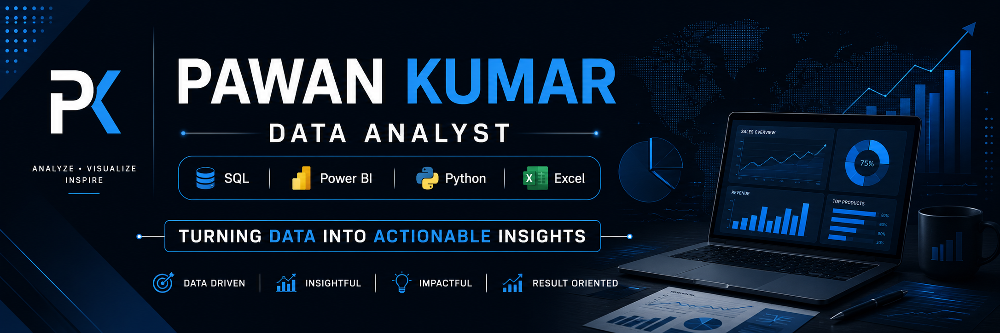

  

# 👋 Hi, I'm Pawan Kumar
# 👋 Hi, I'm Pawan Kumar  

🎯 Data Analyst | Power BI | SQL | Python | Excel | Machine Learning  

📍 Mathura, Uttar Pradesh, India  

---

## 🚀 About Me  
I am a passionate Data Analyst who loves turning raw data into meaningful insights.  
I enjoy working with real-world datasets and building dashboards, reports, and predictive models.

- 📊 Skilled in Data Analysis & Visualization  
- 📈 Love solving business problems using data  
- 🤖 Exploring Machine Learning  
- 📚 Continuously learning new tools & technologies  

---

## 🛠️ Tech Stack  

💻 Languages:  
- Python 🐍  
- SQL  

📊 Data Tools:  
- Power BI  
- Excel  
- Pandas, NumPy  

📈 Visualization:  
- Matplotlib  
- Seaborn  
- Power BI Dashboards  

🗄️ Database:  
- MySQL  

---

## 📂 Projects  

### 🔹 Sales Dashboard (Power BI)
- Built interactive dashboard for sales insights  
- KPIs: Revenue, Profit, Growth  

### 🔹 Customer Segmentation (Python)
- Used clustering (K-Means)  
- Business insights generation  

### 🔹 SQL Analysis Project
- Complex queries (joins, window functions)  
- Real-world dataset analysis  

---

## 📊 GitHub Stats  

---

## 📫 Connect With Me  

- 📧 Email: pawankumar.career2025@gmail.com  
- 💼 LinkedIn: (Add your link here)  
- 🌐 Portfolio: (Optional)  

---

⭐ "Turning Data into Decisions" ⭐
